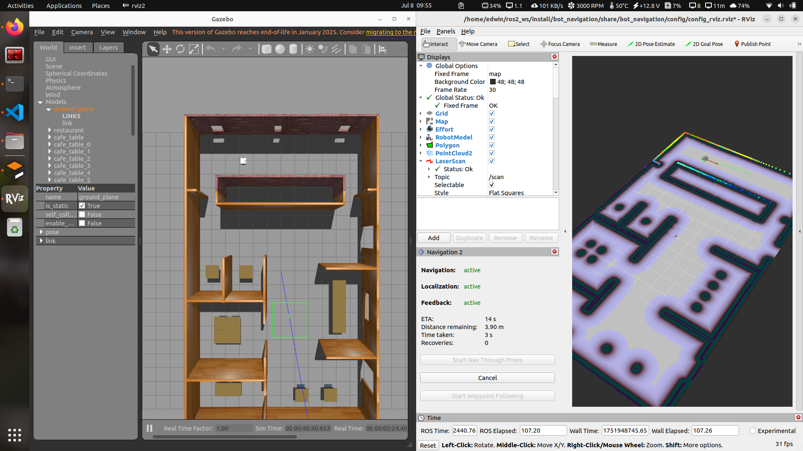

# ROS2 Mobile Robot Gazebo Simulation

This repository provides a ROS2-based simulation environment for a mobile robot, utilizing **Gazebo** for simulation, **SLAM Toolbox** for mapping, and **Navigation2** for autonomous navigation.

---

## 🚀 Getting Started

### Prerequisites

- Ubuntu 22.04 (recommended)
- [ROS2 Humble](https://docs.ros.org/en/humble/Installation.html) installed
- Gazebo, SLAM Toolbox, and Navigation2 packages

### Installation

1. **Clone the repository:**
   ```bash
   git clone https://github.com/yourusername/bot.git ~/ros2_ws/src/bot
   ```

2. **Install dependencies:**
   ```bash
   sudo apt update
   sudo apt install ros-humble-gazebo-ros-pkgs ros-humble-slam-toolbox ros-humble-navigation2 ros-humble-rmw-cyclonedds-cpp
   ```

3. **Build the workspace:**
   ```bash
   cd ~/ros2_ws
   colcon build
   ```

4. **Source the workspace:**
   ```bash
   source ~/ros2_ws/install/setup.bash
   ```

---

## 🏗️ Launching the Simulation

Start the Gazebo simulation environment:
```bash
ros2 launch bot_gazebo gazebo.launch.py
```

---

## 🗺️ Mapping with SLAM Toolbox

1. **Set the RMW implementation:**
   ```bash
   export RMW_IMPLEMENTATION=rmw_cyclonedds_cpp
   source /opt/ros/humble/setup.bash
   ```

2. **Launch SLAM Toolbox for mapping:**
   ```bash
   ros2 launch slam_toolbox online_async_launch.py use_sim_time:=True
   ```

---

## 🧭 Navigation with Navigation2

Launch the Navigation2 stack:
```bash
ros2 launch bot_navigation navigation.launch.py
```

---

## 🖼️ Simulation Media



[Demo Video](assets/video.gif)

---

## 💾 Saving Trajectories

You can save the robot's trajectory using ROS2 parameters and services:

1. **Set parameters:**
   ```bash
   ros2 param set /trajectory_saver_node save_format yaml
   ros2 param set /trajectory_saver_node save_duration 10.0
   ```

   - `save_format`: `"yaml"`, `"csv"`, or `"json"` (default: `"yaml"`)
   - `save_duration`: Seconds of recent data to save (default `0` = all)

2. **Call the save service:**
   ```bash
   ros2 service call /save_trajectory std_srvs/srv/Trigger "{}"
   ```

---

## 📜 Additional Notes

- Ensure ROS2 Humble is properly installed and sourced before running any launch files.
- Modify robot parameters in the `bot_description` package as needed.
- For troubleshooting, consult the [ROS2 documentation](https://docs.ros.org/en/humble/index.html).

---

## 🤝 Contributing

Contributions are welcome! Please open issues or pull requests for improvements.

---

## 📄 License

This project is licensed under the MIT License.

---

**Happy Coding! 🚀🤖**
